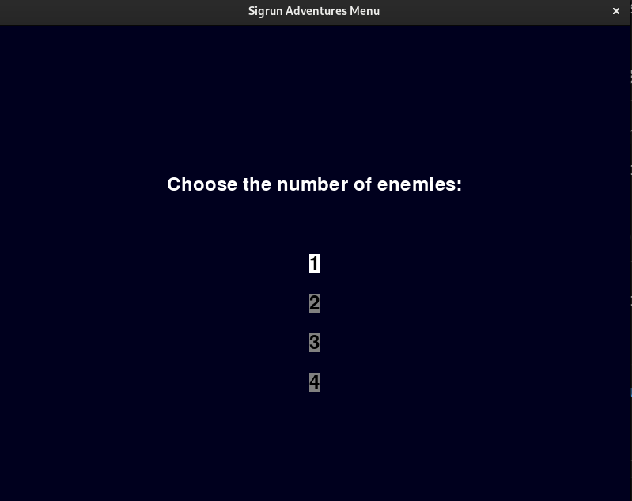
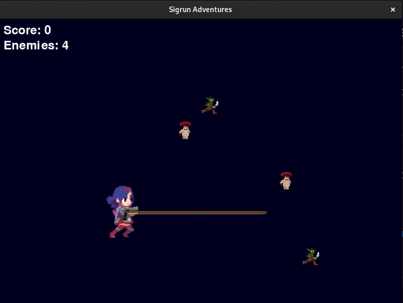
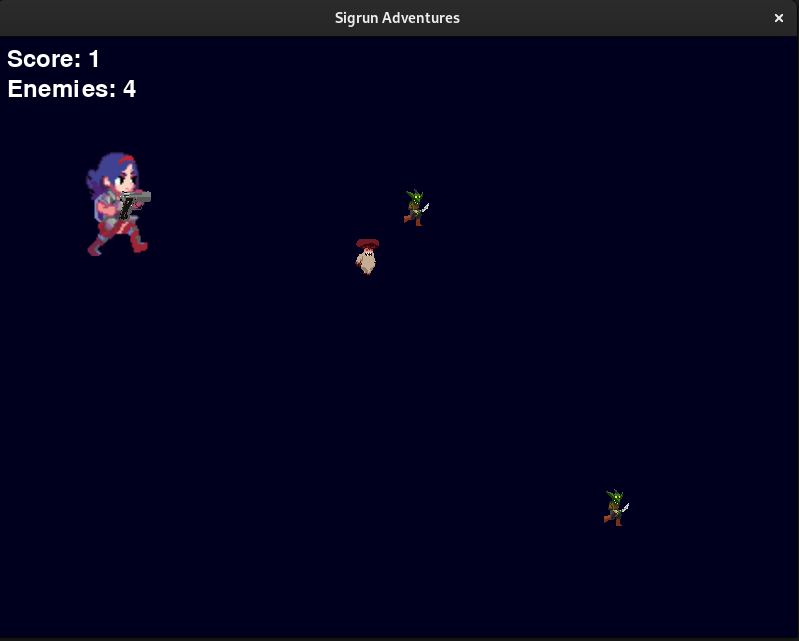
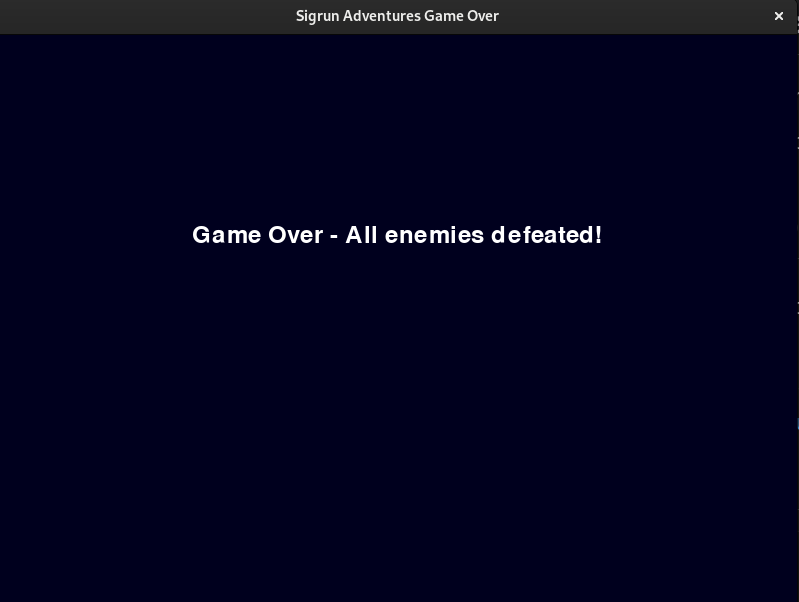

# ¡Sigrún Adventures!


## Descripción
Sigrún Adventures es un juego simple desarrollado en Python utilizando la biblioteca Pygame. En el juego, los jugadores controlan a Sigrún, el personaje principal, y se enfrentan a enemigos mientras intentan alcanzar la puntuación más alta.

## Características Principales
- **Juego de Disparos:** Controla a Sigrun y utiliza su arma para derrotar a los enemigos que se interponen en tu camino.
- **Animaciones y Gráficos:** Disfruta de animaciones suaves y gráficos atractivos que hacen que la experiencia de juego sea visualmente placentera.
- **Menú Interactivo:** Antes de empezar, el jugador puede seleccionar la cantidad de enemigos para ajustar la dificultad del juego.

## Requisitos del Sistema
- Python 3
- Pygame 

## Instrucciones de Ejecución
1. Asegúrate de tener Python 3 instalado en tu sistema.
2. Instala la biblioteca Pygame ejecutando el siguiente comando:
    ```bash
    pip install pygame
    ```
3. Ejecuta el juego utilizando el siguiente comando:
    ```bash
    python main.py
    ```

## Controles del Juego
- **Teclas de Flecha:** Mueven a Sigrun en la dirección correspondiente.
- **Botón Izquierdo del Ratón:** Dispara balas hacia la posición del cursor.

## Terminación del Juego
El juego termina cuando el personaje de Sigrún colisiona con un enemigo o cuando Sigrún termina con todos sus enemigos, lo que pase primero!.

## Algunas Imágenes

 | 
--- | ---
 | 

---

Desarrollado por Jahilyn Linares 2023
